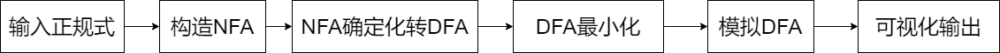
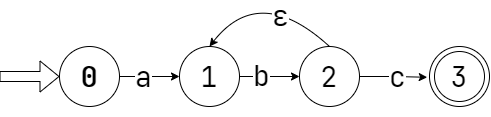
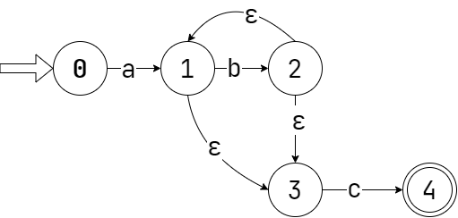
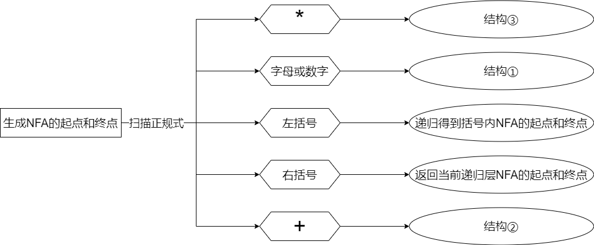
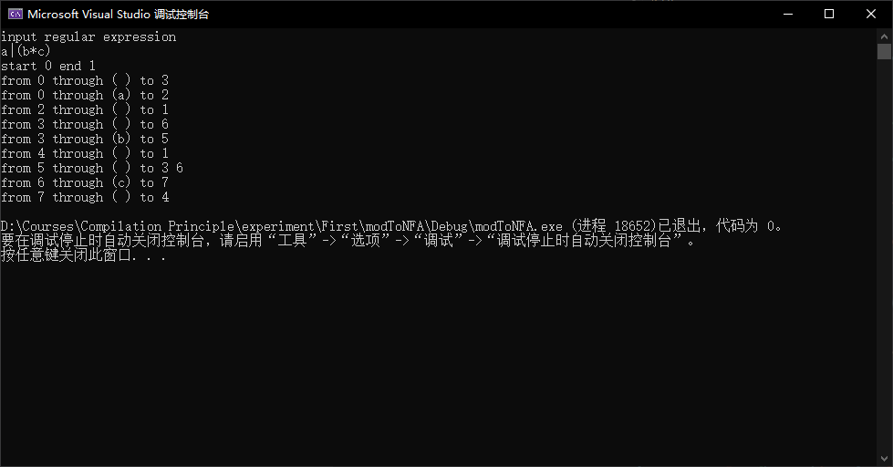
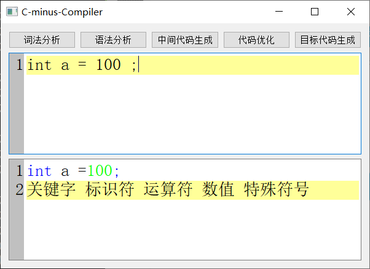
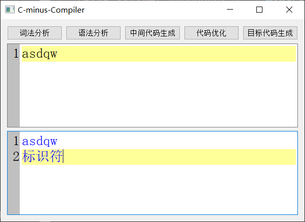
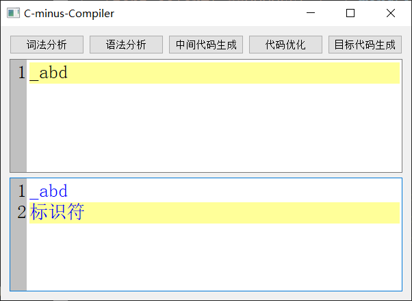
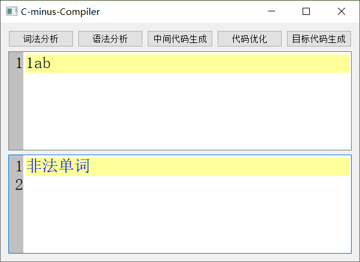
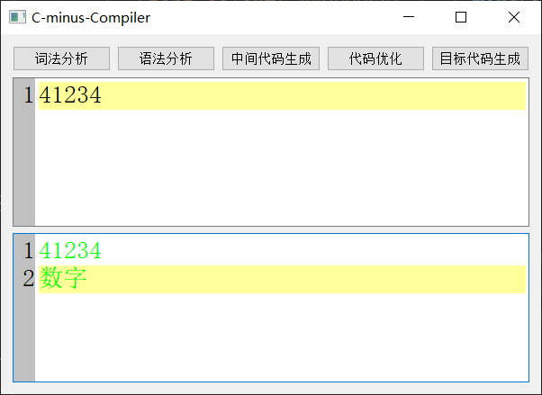

****

# 目录

[1.实验基本信息](#1实验基本信息)

[1.1题目](#11题目)

[1.2实习时间](#12实习时间)

[1.3基本要求](#13基本要求)

[2.需求分析](#2需求分析)

[3.设计](#3设计)

[3.1总体设计](#31总体设计)

[3.1.1设计思想](#311设计思想)

[3.1.2程序运行流程图](#312程序运行流程图)

[3.2自己负责的模块设计](#32自己负责的模块设计)

[3.2.1基本思想](#321基本思想)

[3.2.2函数运行流程图](#322函数运行流程图)

[3.2.3模块接口说明](#323模块接口说明)

[3.3函数功能实现](#33函数功能实现)

[3.4算法设计](#34算法设计)

[3.4.1用正规式构建NFA](#341用正规式构建nfa)

[3.4.2NFA转DFA](#342nfa转dfa)

[3.4.3DFA最小化](#343dfa最小化)

[3.4.4模拟DFA](#344模拟dfa)

[4.调试分析](#4调试分析)

[4.1优点分析](#41优点分析)

[4.2缺点分析](#42缺点分析)

[4.3改进的方法](#43改进的方法)

[5.使用手册](#5使用手册)

[6.测试结果](#6测试结果)

[7.总结](#_Toc72188795)

[8.致谢](#8致谢)

[9.参考文献](#9参考文献)

# 1.实验基本信息

## 1.1题目

C-Minus语言的编译实验（词法分析部分）。

## 1.2实习时间

2021年4月8日晚。

## 1.3基本要求

实验目的：要求用C或C++语言描述及上机调试，实现一个 C-Minus
小编译程序（包括词法分析，语法分析等重要子程序），使学生将理论与实际应用结合起来，受到软件设计等开发过程的全面训练，从而提高学生软件开发的能力。

（1）设计词法分析器

设计各单词的状态转换图，并为不同的单词设计种别码。将词法分析器设计成供语法分析器调用的子程序。功能包括：

a.
具备预处理功能。将不翻译的注释等符号先滤掉，只保留要翻译的符号串，即要求设计一个供词法分析调用的预处理子程序；

b. 能够拼出语言中的各个单词；

c. 返回（种别码， 属性值）。

（2）C－惯用的词法

1、语言的关键字：else if int return void while

2、专用符号：+ - \* / \< \<= \> \>= == != = ; , ( ) [ ] { } /\* \*/

3、其他标记是ID和NUM，通过下列正则表达式定义：

ID = letter letter\*

NUM = digit digit\*

letter = a\|..\|z\|A\|..\|Z

digit = 0\|..\|9

4、空格由空白、换行符和制表符组成。空格通常被忽略，除了它必须分开ID、NUM关键字。

5\. 注释用通常的C语言符号/ \* . . . \*
/围起来。注释可以放在任何空白出现的位置(即注释不能放在标记内)上，且可以超过一行。注释不能嵌套。

# 2.需求分析

-   尽管各个题目各自有所不同，但都是基于词法分析，于是任务的重点在于构造词法分析器。

-   可以使用DFA来进行词法分析，但是DFA对用户来说并不友好，我们需要让用户输入正规表达式，再由程序自动生成DFA。

-   将程序分为五个模块分工完成，分别是：正规表达式转NFA、有限自动机的确定化、确定有限自动机的最小化、模拟DFA、程序框架和界面设计。

-   每一个模块的输出，应当作为下一个模块的输入。

-   利用面向对象的思想设计，构造词法分析器类。

# 3.设计

## 3.1总体设计

### 3.1.1设计思想

#### （1）数据结构

根据问题描述，我们需要将正规表达式转化为自动机，因此不妨设计自动机类class
FA。FA构造函数的参数就是为输入的正规式，通过正规式可构造NFA，再经过确定化、最小化，就能得到一个简洁的DFA，于是就可以判断字符串是否可接受。为表示自动机的结点，还需要定义节点类FANode。

```cpp


FA(std::string stringMod) {

    this-\>stringMod = stringMod;

    //创建自动机 确定化 最小化

    //分别对应任务 1，2 ，3

}

```

自动机的另一个要素就是状态转移，在数学上可视为映射，因此用map表示。NFA的一个状态，接受符号，可到达多个状态；也就是说，NFA是多值映射，接受同一字符可转移到一个状态集合，用map\<FANode,set\<FANode\>\>表示多值映射。而DFA相对简单，是一对一的映射，用map\<FANode,FANode\>表示。map内部的结构是红黑树，因此需要比较键FANode的大小，我们需要在FANode类内重载小于号。

```cpp

class FANode {

private:

    int ID;

    std::string name;

public:

    FANode(std::string name);

    FANode(int ID) {

        this-\>ID = ID;

    }

    //重载小于号

    bool operator\<(const FANode& o)const {

    return ID \< o.ID;

}

public:

    //getter setter

    int getID() const;

    void setID(int ID);

    std::string getName() const;

    void setName(std::string name);

};
```

最后根据自动机的定义，用三个set定义初始状态集、终止状态集、状态集。

完整的自动机FA定义如下。
```cpp

class FA {

    private:

    /\*

    初态集

    终态集

    状态集

    NFA状态转移

    DFA状态转移

    NFA对应DFA的结点

    正规式

    \*/

    std::set\<FANode\> startSet;

    std::set\<FANode\> endSet;

    std::set\<FANode\> states;

    std::map\<FANode, std::map\<char, std::set\<FANode\>\>\> transNFA;

    std::map\<FANode, std::map\<char, FANode\>\> transDFA;

    std::string stringMod;

    void modifyToDFA();

    void minimizeDFA();

    int nodeCount = 0;

public:

    FA(std::string stringMod) {

    this-\>stringMod = stringMod;

    //创建自动机 确定化 最小化

    //分别对应任务 1，2 ，3

    }

    std::pair\<FANode, FANode\> creatNFA();

    //检验是否接受字符串 任务4

    bool check(std::string in);

    std::pair\<FANode, FANode\> creatNFA(int& l);

    };
```

#### （2）文件结构

FANode.h 自动机结点类

FA.h 自动机节点类

FANode.cpp 自动机节点类函数实现

FA.cpp 自动机类函数实现

Main.cpp 主函数文件

#### （3）基本思想

FA构造函数的参数就是为输入的正规式，通过正规式可构造NFA，再经过确定化、最小化，就能得到一个简洁的DFA，于是就可以判断字符串是否可接受。

每一步都通过一个函数实现。

1.  正规式转NFA pair\<FANode, FANode\> creatNFA(int& l);

2.  NFA转DFA void modifyToDFA();

3.  DFA最小化 void minimizeDFA();

4.  模拟DFA bool check(std::string in);

### 3.1.2程序运行流程图



图表 1程序运行流程图

## 3.2自己负责的模块设计

### 3.2.1基本思想

我主要负责设计程序架构和完成正规表达式转NFA的模块。程序架构已经在前面说明，接下来着重分析如何将正规表达式转换为NFA。

对于没有任何特殊符号的正规表达式，如afdsc，可以直接用一条链式的NFA表示，称为结构①。


图表 2结构①

在有正闭包的产生式中，如ab+c，b会出现正整数次，可用如下结构表示，称为结构②。让串至少出现一次b，如果要更多的b，可经过一个空串返回。



图表 3结构②

在有闭包的产生式中，如ab\*c，b会出现非负整数次，可用如下结构③表示。我们分两种情况，即不出现b和出现b的正闭包考虑，于是形成1直接到3，和1到2再到3两路。



图表 4结构③

当产生了a(b\*c)d这样的括号嵌套表达式，我们直接将括号内的部分也看成一个完整的NFA：遇到左括号时进入下一层递归，遇到右括号时返回括号内的NFA的起点和终点。那么带括号嵌套的NFA结构④可表示如下。实际上，在下一层递归中，我们已经将b\*c拆分成了类似结构③的形式，只不过在这一层函数没有体现出来。构造完a，当前点为1，下一层递归返回b\*c构成的自动机起点为，终点为；于是从1伸出一个空串指向，然后经过b\*c段，再从伸出d，构造新的结点。


图表 5结构④

因为我们已经将括号中的内容看作一个NFA，因此整个正规表达式可以看作多个NFA用空串进行连接。只不过，当出现括号的情况，如a(b\*c)d，我们显示地获得括号中NFA的起点和终点并用空串进行连接；而正规表达式没有括号时，如ab，我们隐式用带字母的弧连接两个自动机。

### 3.2.2函数运行流程图



### 3.2.3模块接口说明

自动机对象FA直接调用函数creatNFA()，不仅会返回NFA的起点和终点，而且会将表示NFA状态转移的map和所有状态集填充完毕。

实际上，构造NFA的函数分两个，首先是pair\<FANode,FANode\>
creatNFA()。在pair\<FANode,FANode\>
creatNFA()内部，我们先调用pair\<FANode,FANode\> creatNFA(int&
l)（l表示正规式扫描的起点），可以得到NFA的起点和终点，并同时构造状态转移，然后在createNFA()中填充状态集。

```cpp

/// \<summary\>

/// 创建NFA

/// \</summary\>

/// \<returns\>NFA的起点和终点\</returns\>

std::pair\<FANode, FANode\> creatNFA();

/// \<summary\>

/// 创建区间内的NFA

/// \</summary\>

/// \<param name="l"\>正规式开始扫描的位置\</param\>

/// \<returns\>区间内NFA的起点和终点（遇到右括号或正规式扫描完返回）\</returns\>

std::pair\<FANode, FANode\> creatNFA(int& l);
```


## 3.3函数功能实现

```cpp

/// \<summary\>

/// 开始状态集

/// \</summary\>

std::set\<FANode\> startSet;

/// \<summary\>

/// 终止状态集

/// \</summary\>

std::set\<FANode\> endSet;

/// \<summary\>

/// 状态集（包含所有状态）

/// \</summary\>

std::set\<FANode\> states;

/// \<summary\>

/// NFA的状态转移

/// 一个状态经过一个字符转移到多个状态（状态集）

/// \</summary\>

std::map\<FANode, std::map\<char, std::set\<FANode\>\>\> transNFA;

/// \<summary\>

/// 正规表达式

/// \</summary\>

std::string stringMod;

/// \<summary\>

/// NFA结点数目

/// \</summary\>

int nodeCount = 0;

/// \<summary\>

/// 输出NFA的状态转移（图上的边）

/// \</summary\>

void printEdge()
{

    for (const auto &from : transNFA)
    {

        for (const auto &e : from.second)
        {

            std::cout \<\< "from " \<\< from.first.getID() \<\< ' ';

            std::cout \<\< "through (" \<\< e.first \<\< ") to ";

            for (const auto &to : e.second)
            {

                std::cout \<\< to.getID()\<\< ' ';
            }

            std::cout \<\< std::endl;
        }
    }
}

/// \<summary\>

/// 创建NFA

/// \</summary\>

/// \<returns\>NFA的起点和终点\</returns\>

std::pair\<FANode, FANode\> creatNFA();

/// \<summary\>

/// 创建区间内的NFA

/// \</summary\>

/// \<param name="l"\>正规式开始扫描的位置\</param\>

/// \<returns\>区间内NFA的起点和终点（遇到右括号或正规式扫描完返回）\</returns\>

std::pair\<FANode, FANode\> creatNFA(int &l);

##3.4算法设计

    ## #3.4.1用正规式构建NFA

    std::pair\<FANode, FANode\>
    FA::creatNFA()
{

    int l = 0;

    auto StEd = creatNFA(l);

    startSet.emplace(StEd.first);

    endSet.emplace(StEd.second);

    return StEd;
}

std::pair\<FANode, FANode\> FA::creatNFA(int &l)
{

    FANode p(nodeCount++);

    //设置起点

    FANode st = p;

    //设置终点

    FANode ed(nodeCount++);

    states.emplace(st);

    states.emplace(ed);

    for (int i = l; i \< stringMod.size(); i++)
    {

        char c = stringMod[i];

        if (stringMod[i] == '(')
        {

            //进入下一层递归 得到()内的自动机的起点和终点

            l = i + 1;

            auto StEd = creatNFA(l);

            i = l;

            transNFA[p][' '].insert(StEd.first);

            p = StEd.second;
        }
        else if (stringMod[i] == ')')
        {

            //返回上一层

            l = i + 1;

            transNFA[p][' '].insert(ed);

            return std::make_pair(st, ed);
        }
        else if (isalpha(stringMod[i])\|\| isdigit(stringMod[i]))
        {

            FANode newNode(nodeCount++);

            states.emplace(newNode);

            if (i + 1 \< stringMod.size() && stringMod[i + 1] == '+')
            {

                //正闭包

                transNFA[newNode][' '].insert(p);

                transNFA[p][c].insert(newNode);

                p = newNode;
            }
            else if (i + 1 \< stringMod.size() && stringMod[i + 1] == '\*')
            {

                //一个指针通过 c 指向newNode

                //但是这个c因为是\*也可以没有

                //所以在搞一个newNodenew，用空串指向它

                transNFA[newNode][' '].insert(p);

                FANode newNodeNew(nodeCount++);

                transNFA[p][' '].insert(newNodeNew);

                transNFA[newNode][' '].insert(newNodeNew);

                transNFA[p][c].insert(newNode);

                p = newNodeNew;

                states.emplace(newNodeNew);
            }
            else
            {

                transNFA[p][c].insert(newNode);

                p = newNode;
            }
        }
        else if (c == '\|')
        {

            transNFA[p][' '].insert(ed);

            p = st;
        }
    }

    transNFA[p][' '].insert(ed);

    return std::make_pair(st, ed);
}

## #3.4.2NFA转DFA

    //判断两FANode集合a，b是否相等

    bool
    equal(std::set\<FANode\> a, std::set\<FANode\> b)

{

    if (a.size() != b.size())
        return false;

    else

    {

        std::set\<FANode\>::iterator it1, it2;

        for (it1 = a.begin(), it2 = b.begin(); it1 != a.end(), it2 != b.end(); it1++,
            it2++)

        {

            FANode x = \* it1;

            FANode y = \* it2;

            if (x != y)
                return false;
        }
    }
    return true;
}

//判断某FANode集合u是否在队列q中

bool FA::findQue(std::queue\<std::set\<FANode\>\> q, std::set\<FANode\> u)

{

    std::queue\<std::set\<FANode\>\> tmp = q;

    while (!tmp.empty())

    {

        std::set\<FANode\> cmp = tmp.front();

        if (equal(cmp, u))
            return true;

        tmp.pop();
    }

    return false;
}

//状态集合I只通过ε操作得到的状态集

std::set\<FANode\> FA::eClosure(const std::set\<FANode\> &I)

{

    //ε操作后得到的状态集一定有I的所有元素

    std::set\<FANode\> result = I;

    std::set\<FANode\> tempNodeSet;

    //定义前向迭代器指向第一个元素

    std::set\<FANode\>::iterator setPtr = I.begin();

    std::stack\<FANode\> tempStack;

    //先将I中的所有元素压入栈

    for (setPtr; setPtr != I.end(); setPtr++)

    {

        tempStack.push(\* setPtr);
    }

    //对栈中的元素逐个操作

    FANode tempFANode;

    while (!tempStack.empty())

    {

        //栈顶状态结点出栈

        tempFANode = tempStack.top();

        tempStack.pop();

        //对这个结点进行ε操作，获取ε操作后的结点集合

        tempNodeSet = this -\> transNFA[tempFANode][' '];

        //将ε操作的后续结点压入栈和结果集合中

        for (setPtr = tempNodeSet.begin(); setPtr != tempNodeSet.end(); setPtr++)

        {

            result.insert(\* setPtr);

            tempStack.push(\* setPtr);
        }
    }

    return result;
}

//状态集合I通过a操作后得到的状态集

std::set\<FANode\> FA::move(const std::set\<FANode\> &I, const char &a)

{

    //初始结果为一个空集合

    std::set\<FANode\> result;

    //定义前向迭代器指向第一个元素

    std::set\<FANode\>::iterator setPtr1 = I.begin();

    std::set\<FANode\>::iterator setPtr2;

    //对集合中的每一个元素进行a操作得到对应的状态集将每一个状态集的元素加入结果集合中

    std::set\<FANode\> tempNodeSet;

    for (setPtr1; setPtr1 != I.end(); setPtr1++)

    {

        tempNodeSet = this -\> transNFA[\* setPtr1][a];

        for (setPtr2 = tempNodeSet.begin(); setPtr2 != tempNodeSet.end(); setPtr2++)

        {

            result.insert(\* setPtr2);
        }
    }

    return result;
}

void FA::subset()

{

    std::set\<FANode\> newEndSet; //新的终态集

    std::set\<FANode\> newStates; //新的状态集

    //未标记的子集族

    std::queue\<std::set\<FANode\>\> unmarked;

    //已经标记了的子集族

    std::set\<std::set\<FANode\>\> marked;

    //将NFA的初态集通过ε操作转化为子集族的第一个成员,并且加入未标记的子集族中

    std::set\<FANode\> subset1 = this -\> eClosure(this -\> startSet);

    std::set\<FANode\> subset2;

    unmarked.push(subset1);

    int id = 0;

    //根据第一个成员获得初始状态结点，新建一个结点并且改名

    FANode newNode = FANode(id++);

    startSet.clear();

    this -\> startSet.insert(newNode);

    newStates.insert(newNode);

    //用来保存已构造的dfa结点

    std::queue\<FANode\> nodeQue;

    nodeQue.push(newNode);

    NFAToDFA[subset1] = newNode;

    //定义前向迭代器指向终态级

    std::set\<FANode\>::iterator setPtr = this -\> endSet.begin();

    //逐个处理未标记子族集中的元素

    while (!unmarked.empty())

    {

        //获取第一个子集

        subset1 = unmarked.front();

        //标记这个子集,从未标记的子集族中移除这个子集

        marked.insert(subset1);

        unmarked.pop();

        //暂存由子集subset1构造的dfa结点，保存后弹出

        FANode pre = nodeQue.front();

        nodeQue.pop();

        for (int i = 0; i \< charTable.size(); i++)

        {

            //将子集subset1经过move操作和ε操作生成新的子集

            subset2 = eClosure(move(subset1, charTable[i]));

            //如果为空集，跳过

            if (subset2.size() == 0)
                continue;

            //如果子集subset2未放入子集族，放入unmarked中且不标记

            if (!marked.count(subset2) && !findQue(unmarked, subset2))

            {

                unmarked.push(subset2);

                //同时由subset2构造DFA结点,结点改名

                FANode node(id++);

                //填充NFA对应的DFA的结点

                NFAToDFA[subset2] = node;

                nodeQue.push(node);

                newStates.insert(node);

                //如果子集subset2含终态结点，则将新构造的结点加入dfa的终态集

                for (setPtr; setPtr != this -\> endSet.end(); setPtr++)

                {

                    if (subset2.count(\* setPtr))

                    {

                        newEndSet.insert(node);

                        break;
                    }
                }

                setPtr = this -\> endSet.begin();
            }

            //更新DFA状态转移

            if (!subset2.empty())

            {

                this -\> transDFA[pre][charTable[i]] = this -\> NFAToDFA[subset2];
            }
        }
    }

    endSet = newEndSet;

    states = newStates;
}

## #3.4.3DFA最小化

    std::set\<FANode\>
    MinDFA::findSet(FANode tmp)
{

    std::set\<FANode\> st;

    for (int i = 0; i \< finStates.size(); i++)
    {

        if (finStates[i].find(tmp) != finStates[i].end())
            return finStates[i];
    }

    return st;
}

int MinDFA::findStates(FANode tmp)
{

    for (int i = 0; i \< finStates.size(); i++)
    {

        if (finStates[i].find(tmp) != finStates[i].end())

            return i;
    }

    return -1;
}

MinDFA::MinDFA(std::string stringMod) : FA(stringMod)
{

    this -\> minStartState = getStartSet();

    this -\> minFinalStates = getEndSet();

    this -\> minTransDFA = getTransDFA();

    this -\> minStates = getStates();
}

// 注意分割的时候传入的是其对应的角标

void MinDFA::makeMinimalDfa()
{

    std::vector\<char\> tmpCharTable = getA();

    finStates.push_back(minFinalStates);

    std::set\<FANode\> tmpbegin;

    std::set\<FANode\> tmpmid[maxn];

    for (auto p = minStates.begin(); p != minStates.end(); p++)
    {

        if (minFinalStates.find(\* p) == minFinalStates.end())
        {

            tmpbegin.insert(\* p);
        }
    }

    finStates.push_back(tmpbegin);

    tmpbegin.clear();

    // 首先对于起始的终点而言

    std::vector\<int\> matrix[maxn];

    for (int k = 0; k \< finStates.size(); k++)
    {

        if (!finStates[k].size())
            continue;

        for (auto i = tmpCharTable.begin(); i != tmpCharTable.end(); i++)
        {

            int flag = 0;

            int cnt = 0;

            for (auto p = finStates[k].begin(); p != finStates[k].end(); p++, cnt++)
            {

                FANode tmp(-1);

                // if (minTransDFA[\*p][\*i].getId() \< 0) {

                // continue;

                //

                //}

                if (minTransDFA[\* p][\* i].getId() \< 0)

                    tmp = FANode(p -\> getId());

                else
                {

                    tmp = minTransDFA[\* p][\* i];
                }

                if (findStates(tmp) != k)
                {

                    flag = 1;

                    int tmpk = findStates(tmp);

                    tmpmid[findStates(tmp)].insert(\* p);
                }

                else
                {

                    tmpbegin.insert(\* p);
                }
            }

            if (tmpbegin.size())
                finStates[k] = tmpbegin;

            // 这样的话 本质上是进行了简单的替换

            for (int t = 0; t \< finStates.size(); t++)
            {

                int f = 1;

                if (tmpmid[t].size())
                {

                    int ans = 0;

                    for (int kk = 0; kk \< finStates.size(); kk++)
                    {

                        auto q = tmpmid[t].begin();

                        if (tmpmid[t].size() != finStates[kk].size())
                            continue;

                        int f = 1;

                        for (auto p = finStates[kk].begin(); p != finStates[kk].end(); p++)
                        {

                            if (p -\> getId() != q -\> getId())
                            {

                                f = 0;
                                break;
                            }

                            q++;
                        }

                        if (f)
                            ans = 1;
                    }

                    if (!ans)
                        finStates.push_back(tmpmid[t]);
                }

                tmpmid[t].clear();
            }

            tmpbegin.clear();
        }
    }
}

void MinDFA::formFinTransDFA()
{

    std::vector\<char\> str = charTable;

    std::map\<FANode, std::map\<char, FANode\>\> tmpMinTransDFA;

    for (int i = 0; i \< finStates.size(); i++)
    {

        for (auto j = str.begin(); j != str.end(); j++)
        {

            // finTransDFA[finStates[i]][\*j] =
            findSet(minTransDFA[\* finStates[i].begin()][\* j]);

            FANode fa = FANode(i);

            std::set\<FANode\> s = findSet(minTransDFA[\* finStates[i].begin()][\* j]);

            int kk = -1;

            for (int k = 0; k \< finStates.size(); k++)
            {

                if (s == finStates[k])
                {

                    kk = k;
                }
            }

            FANode fb;

            if (kk != -1)
                fb = FANode(kk);

            tmpMinTransDFA[fa][\* j] = fb;
        }
    }

    std::set\<FANode\> tmpEnd;

    std::set\<FANode\> tmpStart;

    std::set\<FANode\> tmpStates;

    for (int i = 0; i \< finStates.size(); i++)
    {

        FANode fa(i);

        for (auto j = minFinalStates.begin(); j != minFinalStates.end(); j++)
        {

            if (finStates[i].find(\* j) != finStates[i].end())

            {

                tmpEnd.insert(fa);
            }
        }

        for (auto j = minStartState.begin(); j != minStartState.end(); j++)
        {

            if (finStates[i].find(\* j) != finStates[i].end())
            {

                tmpStart.insert(fa);
            }
        }

        tmpStates.insert(fa);
    }

    minTransDFA = tmpMinTransDFA;

    minFinalStates = tmpEnd;

    minStartState = tmpStart;

    minStates = tmpStates;
}

## #3.4.4模拟DFA

    char
    ex(char c)

{

    if (c \>= 'A' && c \<= 'Z')
        return tolower(c);

    return c;
}

//专用符号

std::set\<std::string\> oc = {

    ";", "+", "-", "\*", "/",
    "=", "\<", "\<=", "\>", "\>=", "==", "!=", "=", ";", ",", "(", ")", "[", "]", "{", "}", "/\*", "\*/"

};

//关键字

std::set\<std::string\> ob = {

    "else", "if", "int", "return", "void", "while"

};

//判断s是否为专用符号

bool isZYFH(std::string s)

{

    if (oc.count(s) == 1)
        return true;

    return false;
}

//判断s是否为关键字

bool isGJZ(std::string s)

{

    if (ob.count(s) == 1)
        return true;

    return false;
}

//判断字符串s的token类型

std::string MinDFA::judge(FANode node, std::string s)

{

    if (isGJZ(s))
        return (s + "关键字");

    if (isZYFH(s))
        return (s + "专用符号");

    if (type == 0)
        return "ID ";

    else
        return "NUM ";
}

int MinDFA::check(std::string in)
{ //读入字符串，判断是否接收

    std::string path;

    FANode start = \* minStartState.begin(); // dfa是主程序中构造好的

    FANode state = start;

    path = ""; //初始化path

    std::cout \<\< "type" \<\< "\\t\\ttoken" \<\< std::endl;

    for (int i = 0; i \< in.length(); i++)
    { //遍历字符串的每一个字符

        char c = ex(in[i]);

        if (minFinalStates.count(state) == 1) //判断当前状态是否为终态

        { //若为终态

            if (minTransDFA[state].find(c) != minTransDFA[state].end())
            //判断字符能否使状态转换为另一个状态

            {

                state = minTransDFA[state][c];

                path += in[i];

                continue;
            }

            else

            {

                if (i \< in.length() - 1)

                    return 0; //提前到终止状态了

                else

                {

                    std::cout \<\< "success";

                    std::cout \<\< judge(state, path) \<\< "\\t" \<\< path \<\< std::endl;
                    //将终态输出并初始化state和path

                    return 1;
                }
            }
        }

        if (minTransDFA[state].find(c) == minTransDFA[state].end())
        //判断字符能否使状态转换为另一个状态

        { //不能转换状态

            return 0;
        }

        else
        {

            state = minTransDFA[state][c]; //能则转换状态

            path += in[i];

            if (minFinalStates.count(state) == 1 && i == in.length() - 1)
            //判断当前状态是否为终态

            { //若为终态

                std::cout \<\< "success";

                std::cout \<\< judge(state, path) \<\< "\\t" \<\< path \<\< std::endl;
                //将终态输出并初始化state和path

                return 1;
            }
        }
    }
}
```


# 4.调试分析

## 4.1优点分析

-   将括号中的内容看成一个完整的自动机，是简单的递归思想。

-   将不同情况总结归类，形成了几种典型的结构。

-   采用面向对象的方法进行程序设计，思路清晰，完整体现了自动机的构建过程。

## 4.2缺点分析

-   递归函数一旦进行深入思考，就容易调入思想的圈套，难以了解到构建NFA过程中的细节。

-   对结构进行了归类，使得程序对处理特殊结构的内容时不具有灵活性。

-   构造NFA的过程中引入了大量空串，不利于接下来的工作。

-   输出效果比较简单，没有详细的构建过程。

-   可识别的字符较少，也没有对“\*”、“+”等字符进行转义。

## 4.3改进的方法

-   对闭包和正闭包的结构进一步改进，减少空串的出现。

-   改进输出方式，利用调试信息输出构造NFA的过程。

# 5.使用手册

按照提示输入正规表达式（由“\*”、“+”、“\|”、括号、字母构成），输出NFA的起点和终点，接着输出NFA的所有状态转移。

状态转移用from through to
表示，意思是状态接受字符到达状态，若为空格，表示字符为空串。

# 6.测试结果



图表 6测试结果（自己的部分：正规式转NFA）



图表 7最终效果



图表 8最终效果



图表 9最终效果



图表 10最终效果



图表 11最终效果


图表 12最终效果

# 7.总结

通过对编译原理的学习，特别是词法分析器的编程实践，我加深了对词法分析的理解，将教科书上分割开的知识点（NFA构造、NFA转DFA、DFA最小化、模拟DFA）链接了起来。

虽然思路清晰，但是想要编写成代码不是易事，最终的代码是在调试中一路修改思路得到的。从程序实现效果上说，我完成了正规表达式转NFA的工作，输出的NFA状态转移正确；美中不足的是，这个模块能接受的字符较少，对一些特殊符号会产生bug，且结构不够优美。

此次实验第一次接触多人的小组合作模式。尽管在实验前就已经约定好程序架构、规范和统一的数据结构，但还是在整合代码的过程中出现了前一步输出与后一步输入不匹配、代码凌乱等情况，原因有三：第一，总体的架构并不是特别优美，在编写代码过程中往往需要进行一些小修小改；第二、各个组员水平高低不齐，难以达到同一认知；第三、没有规定代码风格。

经过此次实验，我不仅认识到自己编码能力的不足，也理解了团队协作的重要性。

# 8.致谢

首先感谢刘远兴老师对本次实验的悉心教导。

同时更要感谢小组内成员，我们互帮互助、同心协力完成了此次实验；尽管有诸多瑕疵，但是互相探讨问题的氛围值得回味良久，我在其中享受到思考的快乐。

# 9.参考文献

1.  王生原. 编译原理.第3版[M]. 清华大学出版社, 2015.
